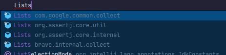

# Date Conversion

The JDK provides the class `java.text.SimpleDateFormat` to convert `java.util.Date` from/to `java.lang.String`. **This class must not be used as it is slow and not thread-safe**. Instead, use the class `org.apache.commons.lang3.time.FastDateFormat`, which offers the same methods but is faster and thread-safe. As this class is thread-safe, only one instance should be created for a given date format.

# Enum

## No Setter

It is possible to specify a value to refine the behavior of an `enum`. To access this value, a getter is necessary, but you should never define a setter for this variable. **An `enum` is unalterable** and must remain so.

```java
import lombok.Getter;
import lombok.RequiredArgsConstructor;

import java.util.Map;

@RequiredArgsConstructor
@Getter
public enum ActivityParticipationStatus implements ValuableEnum<Integer> {
    REQUESTED(0),
    REGISTERED(1),
    REJECTED(2),
    CANCELLED_BY_HOST(3),
    CANCELLED_BY_PARTICIPANT_AFTER_ACCEPTANCE(4),
    CANCELLED_BEFORE_ACCEPTANCE(5),
    CANCELLED_AUTOMATICALLY_AFTER_ACTIVITY_END(6),
    AWAITING_PAYMENT(7),
    CANCELLED_BY_MODERATION(8);

    private final Integer value;
    // Never define a setter for field value
    private static final Map<Integer, ActivityParticipationStatus> valueToEnumMap = EnumUtils.initialize(ActivityParticipationStatus.values());

    public static ActivityParticipationStatus fromValue(int value) {
        return valueToEnumMap.getOrDefault(value, ActivityParticipationStatus.REQUESTED);
    }
}
```

## Equality

Since `enum` values are constants, there is no need to use the `equals` method to compare them. Use `==` which is faster.

```java
if (myObject.getStatus() == Status.IN_PROGRESS) {
    // Do something
}
```

# Log an Exception

Logging an exception is straightforward. There is no need to call `getMessage()` or other methods from the caught `Exception`:

```java
try {
    deleteObject(id);
} catch (Exception e) {
    log.error("An error occurred while trying to delete the object {}", id, e);
}
```

With this log trace, you will have:
- Precise information about what was being done when the exception was thrown.
- The exception message with a complete stack trace.

# Choose the Right Import

Be careful about the import you choose. During reviews, I have seen many incorrect classes imported, especially the `Lists` class.



In this case, the correct import is the first one as `assertj` packages should only be used for unit tests.
